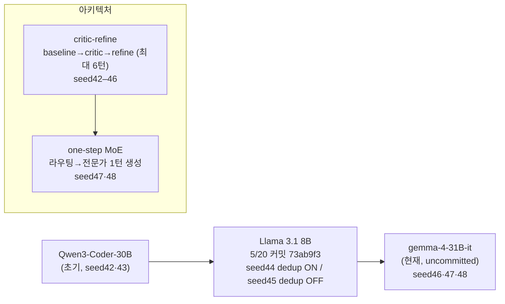
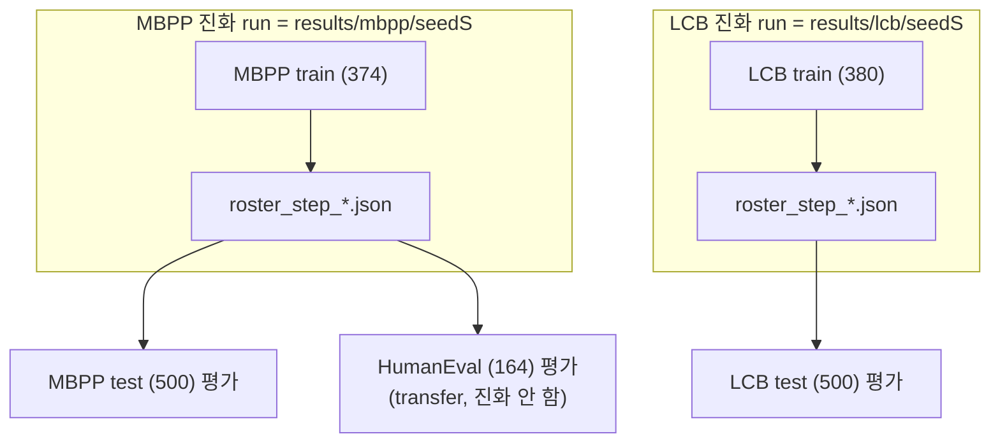

# Meta-Agent Evolution 실험 기록 (seed 20210044 – 20210048)

> 최종 갱신: 2026-06-01. 대상: MBPP / HumanEval / LiveCodeBench(LCB) 진화·평가 실험.
> 모든 수치는 `results/<dataset>/seed<seed>/...score.json` 및 `evolution_log.jsonl`에서 직접 집계.

---

## 0. 한눈에 보기

> **데이터셋 구분(중요)**: 한 seed가 곧 한 데이터셋이 아님. **진화(train)는 데이터셋별로 독립 run**(roster·results 디렉토리 분리)이고, **평가(test)는 그 진화 로스터로 여러 벤치마크를 측정**함. 특히 **HumanEval은 진화하지 않고 MBPP 진화 로스터로 transfer 평가만** 함. 따라서 같은 seed47이라도 `MBPP 진화 run`과 `LCB 진화 run`은 완전히 별개다.

| seed | 진화(train) run | 평가(test) 벤치 | 백본 | 아키텍처 | 핵심 변경 | 상태 | 대표 성능(test pass@1) |
|------|----------------|-----------------|------|----------|-----------|------|------------------------|
| 20210044 | MBPP, LCB (각각 독립) | MBPP·HumanEval(MBPP로스터) / LCB(LCB로스터) | Llama 3.1 8B | critic-refine | **scout dedup ON** (Jaccard 직교성) | 완료 | MBPP 37%(E2) / LCB 10.6%(E2) |
| 20210045 | MBPP | MBPP·HumanEval | Llama 3.1 8B | critic-refine | **scout dedup OFF** (44와 ablation 쌍) | 완료(E4까지) | MBPP 33.8%(E1) / HE 41.5%(E4) |
| 20210046 | MBPP | MBPP·HumanEval | gemma-4-31B-it | critic-refine | 백본 대형화 | 부분(E1–E2) | MBPP 74.8%(E1) / HE 85.4%(E2) |
| 20210047 | MBPP, LCB (각각 독립) | MBPP·HumanEval(MBPP로스터) / LCB(LCB로스터) | gemma-4-31B-it | **one-step MoE** | critic-refine→1턴 생성, lives=3 | MBPP 완료 / LCB 진행중 | MBPP 78.2%(E5) / HE 83.5%(E3) |
| 20210048 | MBPP | MBPP·HumanEval | gemma-4-31B-it | one-step MoE | **프롬프트 decontamination (47 기반)** | 제출 예정 | — |

네 번의 변경 축이 있었음:
0. **scout dedup ablation** (44 ON → 45 OFF): scout 직교성 강제(Jaccard overlap retry)의 효과 측정. 44/45는 모델·epoch·batch 동일, dedup 로직 ON/OFF만 다름 (런타임 로그로 확정).
1. **백본 전환** (45→46): Llama 3.1 8B → gemma-4-31B-it. 성능이 30%대 → 75%대로 급등.
2. **아키텍처 전환** (46→47): critic-refine → one-step raw generation MoE. 라우팅 정상화 + 평가 시간 단축.
3. **데이터 정화** (47→48, 예정): **47의 MBPP artifact 문제(22/40)를 보고** few-shot 오염 제거. dedup(44/45)과는 다른 축 — scout **입력** 정화이지 **출력** 직교성이 아님.

---

## 1. 백본 / 아키텍처 변천 타임라인



git 근거:
- `3f3a3d1` (5/16): `model: Qwen/Qwen3-Coder-30B-A3B-Instruct`
- `73ab9f3` (5/20): → `meta-llama/Meta-Llama-3.1-8B-Instruct`
- uncommitted (`git diff HEAD configs/base.yaml`): → `google/gemma-4-31B-it`, `max_lives: 3` 추가

---

## 2. 공통 설정 (현재 `configs/base.yaml`)

| 항목 | 값 |
|------|-----|
| model | `google/gemma-4-31B-it` |
| max_model_len / max_tokens | 16384 / 8192 |
| sampling | temp=1.0, top_p=0.95, top_k=64, rep_penalty=1.05 (gemma 권장) |
| max_num_seqs / infer_batch_size | 64 / 64 |
| batch_size | 50 |
| max_lives | 3 (seed47부터 도입) |
| action_gate | lambda_size=0.05, scale=0.25 |
| war_tiebreak | random |

데이터셋별 (`configs/*_train.yaml`):
- MBPP: train_size=374, epochs=5, batch_size=50 → **8 steps/epoch, 40 steps**
- LCB: train_size=380, epochs=5, batch_size=50

---

## 2-1. 데이터셋 구조 (진화 run vs 평가 벤치)

핵심 규칙:
- **진화 run = 데이터셋 1개**. MBPP 진화와 LCB 진화는 서로 다른 train split·roster·results 디렉토리를 쓰는 **독립 실행**이다 (`results/mbpp/seed<S>/` vs `results/lcb/seed<S>/`).
- **평가는 진화로 얻은 로스터(roster_step_*.json)로 수행**하며, 한 진화 run을 여러 벤치로 평가할 수 있다.
- **HumanEval은 진화 대상이 아님** — MBPP로 진화한 로스터를 그대로 HumanEval에 적용하는 **transfer/일반화 평가**다.



| seed | MBPP 진화 | LCB 진화 | MBPP test | HumanEval(transfer) | LCB test |
|------|-----------|----------|-----------|----------------------|----------|
| 44 | O | O | O | O | O |
| 45 | O | — | O | O | — |
| 46 | O | — | O | O | — |
| 47 | O | O(진행중) | O | O | 대기 |
| 48 | O(예정) | — | 예정 | 예정 | — |

- 진화 run 디렉토리: `results/mbpp/seed<S>/mbpp/seed<S>/`(roster 스냅샷), `results/lcb/seed<S>/lcb/seed<S>/`.
- 평가 산출물: `results/mbpp/seed<S>/inference_test_epoch<E>.score.json`, `results/humaneval/seed<S>/inference_epoch<E>.score.json`, `results/lcb/seed<S>/inference_test_epoch<E>.score.json`.

---

## 3. seed별 상세

### seed 20210044 — Llama 3.1 8B, critic-refine (배치 50 정착 기준선)

- **목적**: scout 중복제거(dedup) **ON** 조건. 5 epoch / batch 50 워크플로 + MBPP·LCB 동시 기준선.
- **아키텍처**: baseline 생성 → critic → refine 루프.
- **dedup 설정 (런타임 확정)**: 최종 잡 `mae_evolve_mbpp.161049`(5/25)에서 scout Jaccard overlap 직교성 검증이 **8회 발동** (`[Attempt 1] Proposed domain overlaps with: ... (Overlap: 37.50%~50.00%). Retrying...`). → 페르소나가 다양하게 강제됨 (`Input_Operations / Test_Case / Code_Smells / Error_Propagation / Optimization / Type_Hierarchy ...`).
- **진화 (MBPP)**: 39 steps, 5 epochs. decisions = add 14 / swap 9 / delete 9 / noop 7. UB 38→최대 72→58. 최종 로스터 6명 (`luca, c_9473, c_63567, c_10319, c_25054, c_36535`).
- **진화 (LCB)**: 124 steps, 5 epochs. add 31 / swap 26 / delete 28 / noop 39. UB 12→최대 100→92. 최종 `luca, c_16314`.
- **평가 (test pass@1)**:
  - MBPP: E1 31.6 / E2 37.0 / E3 33.0 / E4 30.0 / E5 30.8
  - HumanEval: E1 32.9 / E2 37.2 / E3 34.8 / E4 34.8 / E5 32.3
  - LCB: E1 8.6 / E2 10.6 / E3 10.6 / E4 10.2 / E5 9.2
- **해석**: 8B 백본이 약해 라우팅/리파인 이득이 init_persona baseline(MBPP 31.8%) 수준에 머무름. LCB는 10% 내외로 매우 낮음.
- **참고**: seed44 폴더는 5/20~5/25 동안 6번 재실행(전부 새 시작)됐고, 디스크에 남은 최종 results는 마지막 잡 161049(dedup ON)의 것. (이전에 "ablation이 오염됐다"고 본 추정은 철회 — 44 최종=ON / 45=OFF로 대비 성립.)

### seed 20210045 — Llama 3.1 8B, critic-refine (scout dedup OFF, 44와 ablation 쌍)

- **목적**: seed44와 동일 조건(Llama8B/critic/5ep/batch50)에서 scout 중복제거(dedup) **OFF** 효과 측정.
- **dedup 설정 (런타임 확정)**: 잡 `mae_evolve_mbpp.163946`(5/27)에서 overlap/retry/Attempt 로그 **0회**. scout 38회 호출됐는데 직교성 검증이 단 한 번도 발동하지 않음 → dedup **미발동(OFF)**.
- **스모킹 건**: 페르소나가 거의 동일 도메인으로 반복 양산됨 — `Edge_Case_*` 8회(예: `Edge_Case_Handler`, `Edge_Case_Verification`, `Edge_Case_Pattern_Detection`(동일 이름 2회), `Edge_Case_Intersection/Validation/Mathematical_Modeling/...`), `Error_Propagation_Analysis` 3회. dedup이 켜져 있었다면 37.5%만 돼도 retry가 걸렸을 것(44 기준)이므로 OFF가 확실.
- **진화**: 38 steps, 5 epochs. add 13 / swap 10 / delete 8 / noop 7. UB 38→최대 78→71. 최종 6명 (`luca, c_52360, c_60958, c_23735, c_21723, c_44152`).
- **평가**: MBPP E1 33.8 / E2 33.2 / E3 32.4 / E4 32.4 (E5 미산출). HumanEval E1 33.5 / E2 37.2 / E3 39.0 / **E4 41.5**.
- **해석**: dedup OFF로 페르소나가 Edge_Case에 갇혔는데도 성능은 seed44(ON)와 동급(30%대), HumanEval은 오히려 E4 41.5%. → **8B 백본에서는 scout 직교성 강제의 실질 이득이 크지 않았음**.

### seed 20210046 — gemma-4-31B-it, critic-refine (백본 대형화)

- **목적**: 백본을 gemma-4-31B로 올렸을 때의 효과 측정.
- **진화**: 40 steps, 5 epochs. **noop 24** / add 8 / delete 7 / swap 1. UB 78→최대 88→79. 최종 로스터 **2명** (`luca, c_9727`) — luca 영구 생존.
- **평가**: MBPP E1 **74.8** / E2 74.6. HumanEval E1 84.1 / E2 **85.4**. (E3+ 미평가)
- **해석**: 백본만 바꿔도 30%대 → 75%대로 급등. 단 라우팅 inference가 JSON 파싱 실패로 사실상 **100% luca fallback**, noop 비율 높음. 페르소나는 critic 관점(`Strict_Test_Case_Validator`, `Deterministic_Output_Architect` 등), artifact-themed 제안 4/40.

### seed 20210047 — gemma-4-31B-it, one-step MoE (아키텍처 전환)

- **목적**: critic-refine → 라우팅+전문가 1턴 생성으로 전환, lives=3 도입.
- **아키텍처 변경**:
  - 생성: 전문가 `system_prompt` 하 1턴 (thinking ON, 확률적 샘플링)
  - 라우팅: 견고한 JSON 파싱 → 실제 라우팅 동작
  - 채점 병렬화 + 배치 inference → 평가 ~6h (기존 ~30h+)
- **진화 (MBPP)**: 40 steps, 5 epochs. noop 18 / add 11 / delete 10 / swap 1. UB 76→**최대 90**→88. **Step 7에 luca 삭제**. 최종 2명 (`c_25916, c_7430`).
- **진화 (LCB)**: 진행중 (아래 §5).
- **평가 (test pass@1)**:
  - MBPP: E1 77.6 / E2 76.0 / E3 77.8 / E4 77.0 / **E5 78.2**
  - HumanEval: E1 71.3 / E2 79.3 / **E3 83.5** / E4 72.6 / E5 76.8
- **해석**: critic-refine(seed46 74.8%) 대비 MBPP +3~4%p, 라우팅 정상화. 단 **artifact-themed 페르소나 제안 22/40** — 후반 Step 33–40은 `Benchmark_*_Recovery`류만 나오고 전부 noop. 최종 로스터도 `Heuristic_Intent_Synthesis`, `Interleaved_Task_Isolation`(프롬프트 오염 대응 전문가).

### seed 20210048 — gemma-4-31B-it, one-step MoE + 프롬프트 decontamination (제출 예정)

> **무엇을 보고 바꿨나**: seed**47**을 보고 바꿈 (44/45의 dedup ablation과 무관). 근거 = seed47 MBPP 진화에서 artifact-themed 페르소나가 **22/40**, 같은 백본·아키텍처의 **LCB seed47은 0/25**(대조). 차이의 유일한 원인이 MBPP loader/프롬프트의 이중 few-shot 오염이었음. 즉 dedup(44/45)이 scout **출력 직교성**을 다뤘다면, 48은 scout **입력 정화**를 다룸.

- **목적**: seed47에서 드러난 "benchmark artifact 집착" 원인(이중 few-shot 오염) 제거 후 재실험.
- **변경 (코드, 적용 완료)**:
  - `data/loader.py` `load_mbpp()`: 고정 3-shot `few_shot_prompt` 제거, `instruction = prompt_text + tests`, `prompt_text` 필드 추가
  - `prompts/baseline_prompts.py` `CODING_GEN_USER`: `### Example`/`is_even` 블록 제거
  - `orchestrator.py`: hard error를 `Problem + Tests`로(=`mbpp_<id>` 노출 제거), `routing_history`는 `prompt_text` 우선 저장
- **제출 스크립트**: `scripts/sbatch/submit_mbpp_seed20210048.sh` (`bash scripts/sbatch/submit_mbpp_seed20210048.sh`)
- **기대**: artifact-themed 페르소나 비율 급감, 알고리즘 도메인 전문가(String/DP/Graph 등)로 수렴. MBPP test 79–82% 예상.

---

## 4. 평가 종합표 (test pass@1, %)

> MBPP·HumanEval은 **MBPP 진화 로스터**로 평가(HumanEval=transfer). LCB는 **LCB 진화 로스터**로 평가. epoch = 진화 로스터 스냅샷(E1=step8, ..., E5=step40).

### MBPP (총 500) — MBPP 진화 로스터
| seed | E1 | E2 | E3 | E4 | E5 |
|------|----|----|----|----|----|
| 44 (Llama8B/critic, dedup ON) | 31.6 | 37.0 | 33.0 | 30.0 | 30.8 |
| 45 (Llama8B/critic, dedup OFF) | 33.8 | 33.2 | 32.4 | 32.4 | — |
| 46 (gemma/critic) | 74.8 | 74.6 | — | — | — |
| 47 (gemma/one-step) | 77.6 | 76.0 | 77.8 | 77.0 | **78.2** |

### HumanEval (총 164) — MBPP 진화 로스터의 transfer 평가 (HumanEval 진화 없음)
| seed | E1 | E2 | E3 | E4 | E5 |
|------|----|----|----|----|----|
| 44 | 32.9 | 37.2 | 34.8 | 34.8 | 32.3 |
| 45 | 33.5 | 37.2 | 39.0 | 41.5 | — |
| 46 | 84.1 | 85.4 | — | — | — |
| 47 | 71.3 | 79.3 | **83.5** | 72.6 | 76.8 |

### LiveCodeBench (총 500) — LCB 진화 로스터 (MBPP run과 별개)
| seed | E1 | E2 | E3 | E4 | E5 |
|------|----|----|----|----|----|
| 44 | 8.6 | 10.6 | 10.6 | 10.2 | 9.2 |
| 47 | 진행중 | | | | |

### 베이스라인 (참고)
| 설정 | MBPP raw | MBPP init_persona | MBPP self-refine | HE raw |
|------|----------|-------------------|------------------|--------|
| Llama 3.1 8B | 44.8 | 31.8 | 35.6 | 59.8 |
| Qwen3-Coder-30B | 67.6 | 62.0 | 63.6 | — |

---

## 5. 진화 종합표 (decision 분포 / UB / 최종 로스터)

| run | steps | epochs | add | swap | delete | noop | UB(시작→최대→끝) | 최종 로스터 | artifact 페르소나 | dedup retry |
|-----|-------|--------|-----|------|--------|------|-------------------|-------------|--------------------|-------------|
| mbpp/44 | 39 | 5 | 14 | 9 | 9 | 7 | 38→72→58 | 6명 | 0/39 | **8회 (ON)** |
| mbpp/45 | 38 | 5 | 13 | 10 | 8 | 7 | 38→78→71 | 6명 | 0/38 | **0회 (OFF)** |
| mbpp/46 | 40 | 5 | 8 | 1 | 7 | 24 | 78→88→79 | 2명 (luca 생존) | 4/40 | n/a |
| mbpp/47 | 40 | 5 | 11 | 1 | 10 | 18 | 76→90→88 | 2명 (luca 삭제) | **22/40** | n/a |
| lcb/44 | 124 | 5 | 31 | 26 | 28 | 39 | 12→100→92 | 2명 | 0/124 | n/a |
| lcb/47 | 25+ | 진행중 | 11 | 4 | 6 | 4 | 48→87→82 | 6명(현재) | **0/25** | n/a |

> "artifact 페르소나" = `Benchmark/FewShot/Prompt/Truncated/Interleaved/Contaminated/Distractor/Recovery/Isolation/Intent` 등 키워드를 포함한 `candidate_persona` 수.
> "dedup retry" = scout Jaccard overlap 직교성 검증 발동 횟수 (`mae_evolve_mbpp.<job>.out`). 44=ON(8회), 45=OFF(0회)가 두 run의 결정적 차이. 46+는 dedup 로직이 이후 제거되어 n/a.

---

## 6. 핵심 발견 — "Benchmark artifact 집착" 원인

- **MBPP 데이터가 이중 few-shot 오염 상태**였음:
  1. `load_mbpp()`가 모든 문제 앞에 고정 3-shot(similar_elements/is_not_prime/heap_queue_largest) 부착.
  2. `CODING_GEN_USER`가 그 위에 또 `### Example`(is_even) 래퍼 부착.
- 그 결과 모델 입력이 "여러 task가 섞인 긴 blob"이 되고, scout는 hard error(`### Problem ID: mbpp_767` + truncated instruction)를 **"벤치마크 프롬프트 복구"** 문제로 클러스터링.
- **대조 증거**: 같은 백본·아키텍처라도 **LCB(seed47)는 loader가 깨끗** → artifact 페르소나 **0/25**, 전부 알고리즘 전문가(`State_Transition_and_Interval_Search`, `Combinatorial_Structure_and_Counting` 등). MBPP(seed47)만 22/40.
- → seed48에서 데이터·프롬프트·scout 입력을 모두 정화(이미 코드 반영). 진화 로직(MoE/gate/lives) 자체는 유지.

---

## 7. 현재 진행 상황 (2026-06-01 기준)

| Job | 이름 | 상태 | 비고 |
|-----|------|------|------|
| 169810 | mae_evolve_lcb | RUNNING (n04, 1d+) | LCB seed47 진화, Epoch 4/5, step 26 진행중 |
| 169811 | mae_eval_lcb | PENDING | 169810 dependency |
| 173200 | eval_sft | RUNNING (n03) | 본 실험과 무관 |

- **MBPP seed47**: 진화·평가 완료 (169648 evolution 10h, 169649 eval 6h).
- **LCB seed47**: 진화 진행중 → 완료 후 169811이 epoch별 평가 자동 수행.
- **seed48**: 코드 정화 완료, 미제출. `bash scripts/sbatch/submit_mbpp_seed20210048.sh`로 evolution+eval 체인 제출.

---

## 8. 비교 요약

### 8-1. critic-refine vs one-step MoE
| | critic-refine (seed42–46) | one-step MoE (seed47–48) |
|---|---|---|
| 생성 | baseline→critic→refine (최대 6턴) | 라우팅→전문가 1턴 |
| 라우팅 inference | JSON 실패 시 100% luca fallback | 견고 파싱, 실제 라우팅 |
| 페르소나 | critic(검증/엣지케이스) | expert coder(도메인) |
| 평가 시간 | ~30h+ | ~6h |
| scout 입력 | 실패 코드 포함 | 문제 instruction만 |
| lives 시스템 | 없음 | max_lives=3 |

### 8-2. seed44 vs seed45 (scout dedup ablation)
| | seed44 (dedup ON) | seed45 (dedup OFF) |
|---|---|---|
| 모델 / 아키텍처 / epoch / batch | Llama8B / critic-refine / 5 / 50 | (동일) |
| scout 직교성(Jaccard) | ON | OFF |
| dedup retry 발동 | 8회 | 0회 |
| 페르소나 다양성 | 높음 (Input/Code_Smells/Type_Hierarchy...) | 낮음 (Edge_Case 8회, Error_Propagation 3회) |
| MBPP / HumanEval | 30%대 / E? | 30%대 / E4 41.5 |
| 결론 | 8B에서는 직교성 강제의 실질 이득 작음 (성능 동급) |

### 8-3. dedup(44/45) vs decontamination(48) — 헷갈리기 쉬운 두 축
| | scout dedup (44 vs 45) | prompt decontamination (48) |
|---|---|---|
| 대상 | scout **출력** (페르소나 직교성) | scout/모델 **입력** (오염된 instruction) |
| 메커니즘 | Jaccard overlap retry로 중복 페르소나 차단 | MBPP 이중 few-shot 제거 |
| 무엇을 보고 | (직교성 가설 자체) | seed47 artifact 22/40 vs LCB47 0/25 |
| 시대 | Llama8B / critic-refine | gemma31B / one-step MoE |

---

## 9. seed47 MBPP vs seed48 MBPP 진화 상세 분석

> 동일 조건(gemma-4-31B-it / one-step MoE / 5 epoch / batch 50)에서 MBPP 입력 정화(decontamination)의 효과를 비교한다.
>
> 시각화: `docs/fig_artifact_comparison.png`

### 9-1. seed47 MBPP — 오염 상태에서의 진화

| 항목 | 값 |
|------|-----|
| 전체 steps | 40 (5 epochs) |
| decisions | add 11 / noop 18 / delete 10 / swap 1 |
| UB 궤적 | 76 → **최대 90** → 88 |
| artifact 페르소나 | **23/40 (57.5%)** |
| 최종 로스터 | `c_25916` (Heuristic_Intent_Synthesis), `c_7430` (Interleaved_Task_Isolation) |

**에포크별 오염 진행 상황:**

| Epoch | Steps | Artifact 수/8 | 대표 페르소나 |
|-------|-------|--------------|---------------|
| E1 (1–8) | 1–8 | **3/8** | Prompt_Signal_Isolation, Truncated_Instruction_Recovery, FewShot_Pattern_Completion |
| E2 (9–16) | 9–16 | **6/8** | FewShot_Distractor_Mitigation, Benchmark_Reference_Recovery(×2), Adversarial_Distractor_Filtering |
| E3 (17–24) | 17–24 | **4/8** | Contaminated_Prompt_Surgical, Noisy_Context_Resolution, Competing_Task_Signal_Isolation |
| E4 (25–32) | 25–32 | **5/8** | Heuristic_Intent_Synthesis, Interleaved_Task_Isolation, Synthetic_Dataset_Artifact, Benchmark_Identifier/Specification_Recovery |
| E5 (33–40) | 33–40 | **5/8** | Benchmark_ID_Task_Reconstructor, Benchmark_Parametric_Memory, Dataset_GroundTruth_Recovery, Benchmark_ID_Anchor/Metadata_Recovery |

**핵심 관찰:**
- **Step 3부터 오염 시작** (`Prompt_Signal_Isolation_Specialist`) — 순수 알고리즘 전문가는 Step 1–2 두 명뿐
- Epoch 4–5는 사실상 **100% noop** — 모든 신규 제안이 "벤치마크 복구" 테마로 수렴하고 WAR=0로 거절
- 최종 2명 로스터도 오염 대응 전문가 (`Heuristic_Intent_Synthesis`, `Interleaved_Task_Isolation`)
- **luca가 Step 7에서 삭제**됨 — 초기부터 강력한 선별이 작동했으나 candidate pool 자체가 오염

### 9-2. seed48 MBPP — 입력 정화 후 진화

| 항목 | 값 |
|------|-----|
| 전체 steps | 40 (5 epochs) |
| decisions | add 8 / **noop 21** / delete 6 / swap 5 |
| UB 궤적 | 72 → **최대 94** → 88 |
| artifact 페르소나 | **0/40 (0%)** |
| 최종 로스터 | `c_14798`, `c_20942`, `c_62648` (3명) |

**에포크별 페르소나 도메인:**

| Epoch | 지배 도메인 | 대표 페르소나 |
|-------|------------|---------------|
| E1 (1–8) | **String/Regex** | Regex_and_String_Manipulation(×3), Text_Parsing_and_Regex, Python_Text_and_Pattern |
| E2 (9–16) | String + General Util | Python_Core_API, Foundational_Utility, String_Analysis_and_Collection |
| E3 (17–24) | Array + Math | Array_Manipulation_and_Greedy, Sequential_Boundary_Run_Length, Recursive_Structures_Combinatorial_Math |
| E4 (25–32) | Tree + Combinatorics | Tree_and_Discrete_Math, Regex_and_Recursive_Mathematics, Modular_Arithmetic_Sequence_Grouping |
| E5 (33–40) | Diverse | Data_Sanitization_Spatial_Reasoning, Sieve_and_Integer_Sequence, Priority_Queue, Combinatorial_Generation |

**핵심 관찰:**
- Epoch 1은 String/Regex에 집중 → MBPP train set의 문자열 처리 문제 비율이 높음을 반영
- Epoch 2–5로 갈수록 도메인이 다양해짐 (Array→Tree→Math→Combinatorics)
- **noop이 21/40**으로 많음 → gate가 보수적. UB 최대 94%임에도 전문가 교체 자제
- 최종 로스터 3명 (47의 2명보다 1명 더) — 더 안정적인 군집

### 9-3. 두 run 핵심 비교

| | seed47 MBPP (오염) | seed48 MBPP (정화) |
|---|---|---|
| artifact 페르소나 | **23/40** | **0/40** |
| UB 최대 | 90% | **94%** |
| 최종 로스터 크기 | 2명 | 3명 |
| 최종 로스터 성격 | 오염 대응 전문가 | 알고리즘 도메인 전문가 |
| Epoch 5 noop 비율 | 8/8 (100%) | 3/8 |
| MBPP test (E3) | **77.8%** | 76.0% |
| HumanEval (E3) | **83.5%** | 70.7% |

**해석:** 입력 정화로 artifact 페르소나는 완전히 사라졌고 UB도 더 높게 도달했지만, test 성능에서는 아직 seed47을 넘지 못하고 있음 (E1–3 기준). **가능한 원인:**
1. MBPP inference prompt에서 few-shot 제거 → 모델이 형식 힌트를 잃어 test time 생성 품질 저하
2. train UB가 높아도 test transfer가 항상 성비례하지 않음 (roster가 train 분포에만 최적화)
3. E4·E5 데이터 미출력 — 최종 비교는 평가 완료 후 필요


---

## 10. scout dedup ablation 결과 정리 (발표자료용)

> 대상: seed44 (dedup ON, job 161049) vs seed45 (dedup OFF, job 163946)
> 런타임 로그로 확정된 ablation. 백본·아키텍처·epoch·batch_size 동일 (Llama 3.1 8B, critic-refine, 5 epoch, batch 50).
>
> 시각화: `docs/fig_dedup_ablation.png`

### 10-1. 실험 설계

| | seed44 | seed45 |
|---|--------|--------|
| Jaccard overlap 직교성 검증 | **ON** | **OFF** |
| 발동 횟수 (런타임 로그) | **8회** | **0회** |
| overlap 임계치 | 37.5% 이상 시 retry | (비활성) |
| 나머지 모든 설정 | ← 동일 → | |

### 10-2. 페르소나 다양성 비교

**seed44 (dedup ON)** — 8번 retry로 강제 다양화:
```
Input_Operations → Test_Case → Code_Smells → Error_Propagation → Optimization →
Error_Injection → Code_Maintenance → Type_Hierarchy → Testing_Case_Generation →
Performance_Metrics → Code_Documentation → Input_Sanitization → ...
```
- 도메인: Code Review / Input 처리 / 테스트 케이스 / 성능 / 타입 안전 등 다방면 분산
- dedup 발동 예: `"[Attempt 1] Proposed domain overlaps with: ... (Overlap: 37.50%). Retrying..."`

**seed45 (dedup OFF)** — 중복 제어 없음:
```
Edge_Case_Handler → Edge_Case_Verification → Error_Handling → Edge_Case_Pattern_Detection →
Edge_Case_Pattern_Detection(동일 이름 재등장!) → Edge_Case_Intersection → Edge_Case_Validation →
... Edge_Case_* 계속 8회 ...
Error_Propagation_Analysis(×3)
→ Set_Operation_(5종 변형) ...
```
- **완전한 도메인 단일화**: Edge_Case 계열 8회, 동일 이름 2회 등장
- dedup이 켜져 있었다면 첫 번째 Attempt에서 reject됐을 조합


### 10-3. 최종 로스터 비교 (가장 중요한 증거)

| | seed44 (dedup ON) | seed45 (dedup OFF) |
|---|---|---|
| luca | LUCA (helpful assistant) | LUCA (helpful assistant) |
| 전문가 1 | **Performance_Metric_Optimization** | Edge_Case_Specification_Review |
| 전문가 2 | **Edge_Case** | Edge_Case_Syntactic_Analysis |
| 전문가 3 | **Error_Pattern_Analysis** | Edge_Case_Intersection_Analysis_Ext |
| 전문가 4 | **Code_Maintainability_Evaluator** | **Tuple_Operations** |
| 전문가 5 | **Input_Parsing** | Edge_Case_Semantic_Analysis |
| **도메인 다양성** | **5가지 상이한 도메인** | **Edge_Case 4/5, Tuple 1/5** |

**핵심 관찰:**

seed45(dedup OFF)는 36개 Edge_Case 제안 중 **대부분을 gate가 drop**했다.
- 전체 36회 제안 → 최종 로스터에 남은 Edge_Case 계열: **4명**
- 즉 32개는 WAR=0로 교체·삭제됨 → gate가 실제로 솎아냄

하지만 **제안 pool 자체가 단일화**되어 있었으므로 최종 로스터도 Edge_Case에 수렴.
→ **"gate가 필터한다"와 "다양성이 보장된다"는 별개의 명제**

### 10-4. 성능 결과

| | seed44 (dedup ON) | seed45 (dedup OFF) |
|---|---|---|
| MBPP test | E1 31.6 / **E2 37.0** / E3 33.0 / E4 30.0 / E5 30.8 | E1 33.8 / E2 33.2 / E3 32.4 / E4 32.4 |
| HumanEval | E1 32.9 / E2 37.2 / E3 34.8 / E4 34.8 | E1 33.5 / E2 37.2 / E3 39.0 / **E4 41.5** |
| UB 최대 | 72% | 78% |
| 최종 로스터 구성 | **5개 상이 도메인** | **Edge_Case 4 + Tuple 1** |

### 10-5. 핵심 결론 (발표 포인트)

> **2-phase gate는 중복 페르소나를 자연 도태시키지만, proposal pool 자체의 다양성을 대체하지는 못한다.**

두 단계로 구분해서 봐야 한다:

1. **Gate의 filtering 능력 (입증됨)**: seed45에서 Edge_Case 36개 제안 중 32개 도태 → gate가 실제로 작동
2. **Proposal pool 다양성 (dedup의 역할)**: gate가 걸러줘도, pool이 단일화되면 최종 로스터도 단일화됨

따라서 dedup이 없으면:
- 성능은 비슷하게 수렴 (MBPP ±4%p, 8B에서는 base model이 bottleneck)
- 단, 최종 로스터의 **역할 다양성**은 낮아짐 — 강한 백본에서 중요해질 수 있는 요소

**발표 메시지**: Llama 8B에서는 dedup ON/OFF의 성능 차이가 통계적으로 유의미하지 않다. 그러나 로스터 다양성(seed44: 5도메인 vs seed45: Edge_Case 편향)이 다르므로, **더 강한 백본(gemma-31B)에서 동일 ablation이 필요**하다. 현재 데이터만으로는 dedup의 인과적 기여를 확정할 수 없다.

### 10-6. 보조 증거 — gemma-31B에서는 dedup OFF여도 단일화가 없었다

seed46·48은 **dedup이 없는 채로 gemma-31B로 진행**됐다. 최종 로스터를 seed45(Llama8B, dedup OFF)와 비교:

| seed | 백본 | dedup | 아키텍처 | 최종 로스터 구성 |
|------|------|-------|----------|-----------------|
| 45 | Llama 8B | **OFF** | critic-refine | LUCA + **Edge_Case ×4** + Tuple × 1 → Edge_Case 편향 |
| 46 | gemma-31B | OFF | critic-refine | LUCA + **Strict_Test_Case_Validator** → 2명, 다른 도메인 |
| 48 | gemma-31B | OFF | one-step (clean) | **Array_Manipulation_Greedy** + **Regex_Recursive_Math** + **Data_Sanitization_Spatial** → 3개 상이 도메인 |

**관찰**: Llama 8B(seed45)에서는 dedup OFF → Edge_Case 단일화. 동일하게 dedup OFF인 gemma-31B(seed46, 48)에서는 **Edge_Case 편향이 전혀 나타나지 않음**.

**해석**: seed45의 Edge_Case 단일화는 **dedup 부재의 문제이기도 하지만, Llama 8B scout의 생성 능력 한계이기도 하다.** 강한 백본에서는 scout가 자체적으로 다양한 도메인을 제안하므로 dedup의 필요성이 낮을 수 있다.

> **발표 추가 포인트**: "dedup은 약한 백본의 scout 다양성 부족을 보완하는 보조 장치일 수 있다. gemma-31B급 모델에서는 별도 직교성 강제 없이도 scout가 자연스럽게 다양한 전문가를 제안한다."

---

## 11. 아키텍처 비교: critic-refine vs one-step MoE (gemma-4-31B-it)

> **같은 백본, 다른 아키텍처** 비교. seed46(critic-refine)과 seed47(one-step MoE).
> MBPP 48 decontamination과의 비교도 포함.
> ⚠️ seed47 MBPP는 scout 오염 문제가 있으므로 **MBPP는 오염 caveat 포함, LCB는 별도 제약 참고**.
>
> 시각화: `docs/fig_eval_gemma.png` / `docs/fig_ub_trajectory.png`

> **⚠️ LCB 아키텍처 ablation 불가 (실험 gap)**:
> "같은 백본(gemma-31B)으로 LCB critic-refine vs one-step을 비교"하려면 **seed46 LCB run이 필요하지만 존재하지 않음** (`results/lcb/seed20210046/` 없음). seed46은 MBPP만 실행됨.
> → 현재 가능한 LCB 비교는 **백본까지 달라지는 seed44(Llama8B/critic) vs seed47(gemma-31B/one-step)** 뿐이며 아키텍처와 백본 효과가 혼재됨. 순수 아키텍처 ablation을 원한다면 seed46 LCB 재실험이 필요.

### 11-1. 아키텍처 차이 요약

| | critic-refine (seed46) | one-step MoE (seed47+) |
|---|---|---|
| 생성 흐름 | baseline(1턴) → critic(1턴) → refine(최대 2턴) | 라우팅(1턴) → 전문가 직접 생성(1턴) |
| LLM 호출 수/문제 | 최대 6회 | **2회** |
| 라우팅 실패 시 | JSON 파싱 실패 → **100% luca fallback** | 견고 파싱 → **실제 라우팅** 동작 |
| 페르소나 역할 | critic (검증·피드백 제공) | expert coder (코드 직접 생성) |
| lives 시스템 | 없음 | max_lives = 3 |
| 평가 소요 시간 | ~30h+ | **~6h** |
| noop 비율 (진화) | **24/40 (60%)** | 18/40 (45%) |

### 11-2. MBPP / HumanEval 성능 (MBPP 로스터 기준)

| | seed46 critic-refine | seed47 one-step (⚠️오염) | seed48 one-step (clean, E1-3) |
|---|---|---|---|
| MBPP E1 | 74.8 | 77.6 | 74.0 |
| MBPP E2 | 74.6 | 76.0 | 70.8 |
| MBPP E3 | — | **77.8** | 76.0 |
| MBPP E4 | — | 76.2 | 73.6 |
| MBPP E5 | — | **78.2** | 74.8 |
| MBPP 최고 | 74.8% | **78.2% (E5)** | 76.0% (E3) |
| HE E1 | **84.1** | 71.3 | 76.2 |
| HE E2 | **85.4** | 79.3 | 73.8 |
| HE E3 | — | **83.5** | 70.7 |
| HE E4 | — | 72.6 | 70.7 |
| HE E5 | — | 76.8 | 73.2 |
| HE 최고 | **85.4% (E2)** | 83.5% (E3) | 76.2% (E1) |

**가장 깨끗한 아키텍처 비교: seed46 vs seed48** (동일 백본 gemma-31B, 동일 dedup OFF)

- seed46: critic-refine, MBPP contaminated loader (artifact 4/40으로 영향 미미)
- seed48: one-step MoE, MBPP clean loader, artifact 0/40
- seed47는 오염+one-step이 혼재돼 비교에서 제외

**최종 로스터 대조**: seed46(LUCA + Strict_Test_Case_Validator) vs seed48(Array_Greedy + Regex_Math + Data_Spatial) → one-step이 더 다양한 도메인 전문가를 형성

**주의**: seed46 HumanEval이 높은 이유 — luca가 로스터에 남아 있고 critic 구조가 refine 단계에서 HE 문제에 유리하게 작동했을 가능성. seed47 HE는 초기(E1 71.3%)가 낮다가 회복하는 불안정한 패턴. seed48은 E1-3만 집계됨 (E4·E5 평가 진행 중).


### 11-3. LCB 비교: critic-refine (seed44, Llama8B) vs one-step MoE (seed47, gemma-31B)

> **제약**: seed46(gemma/critic) LCB run 없음 → 같은 백본으로 아키텍처만 분리한 LCB 비교 불가.
> 아래는 **백본(Llama8B → gemma-31B) + 아키텍처(critic-refine → one-step) 두 변수가 동시에 바뀐** 비교이므로 아키텍처 단독 효과로 해석 불가. 참고용으로 제시.

| | seed44 LCB (critic-refine, Llama8B) | seed47 LCB (one-step, gemma-31B) |
|---|---|---|
| train UB 시작 | **12%** | **48%** |
| train UB 최대 | 36% | **87%** |
| artifact 페르소나 | 0/124 | 0/40 |
| decisions | add 31 / swap 26 / delete 28 / noop 39 | add 14 / swap 8 / delete 10 / noop 8 |
| steps 수 | **124** (5 epoch) | **40** (5 epoch) |
| 최종 로스터 | 2명 | 5명 (`luca, c_32396, c_55991, c_40969, c_64411`) |
| 페르소나 도메인 | 알고리즘 전문가 | 알고리즘 전문가 (Graph/DP/Geometry/GameTheory) |
| LCB test pass@1 | E2 10.6% | **평가 진행 중** |

**seed47 LCB 진화 페르소나 (전수)**: 알고리즘 문제 유형과 1:1 매핑되는 깔끔한 전문가 목록
```
Graph_and_Combinatorial → String_and_Bitwise_DP → Math_and_Recursive_Pattern →
Algebraic_Counting_and_Data_Structure → Simulation_and_State_Space →
Number_Theory_and_Structural_Range → Constructive_Analytic_Geometry →
Analytical_Combinatorics_and_Periodic_DP → Order_Theory_and_Structural_Reduction →
Number_Theory_and_Connectivity → Analytic_Combinatorics_and_Computational_Geometry →
Range_Query_and_Bitmask_DP → State_Transition_and_Interval_Search →
Number_Theoretic_and_Recursive → Game_Theory_and_Simulation →
Graph_Structure_and_Isomorphism → Combinatorial_Game_and_Sublinear_Sieve ...
```
- **0/40 artifact** — LCB loader가 깔끔하기 때문 (MBPP 오염 없음)
- 최종 5명 로스터는 seed44 LCB의 2명보다 더 풍부한 커버리지

### 11-4. 아키텍처 전환의 핵심 이득

1. **라우팅 정상화**: critic-refine에서는 JSON 파싱 실패로 100% luca fallback → one-step에서 실제 라우팅 작동
2. **inference 효율**: 30h+ → ~6h (5배 단축) → 실험 사이클 대폭 가속
3. **train UB 향상**: LCB 기준 최대 UB 36% → 87% (백본+아키텍처 복합 효과)
4. **로스터 다양성**: LCB 최종 2명 → 5명
5. **scout 품질**: MBPP loader 문제가 없으면(LCB) 아키텍처 자체가 순수 알고리즘 전문가를 생성

---

## 12. NuminaMath full-train binning (seed16) + failure-mode scout (seed17)

### 12-1. Full-train per-expert binning (잡 185272, COMPLETE)

seed16 최종 5명 로스터가 numina_cot **train 전체(62,185)를 각자 독립으로** 풀고(라우팅 없음) 문제별 풀이 라벨 생성. = 협업자에게 넘길 학습신호(다운스트림 MoE 학습은 우리 영역 아님).

- **전용 파이프라인** `--pipeline binning`([src/pipelines/binning_inference.py](../src/pipelines/binning_inference.py)): 로스터 N명을 단일 chat_batch 한 패스로, 매니저/라우팅 generation 0회. 채점 [scripts/score_binning.py](../scripts/score_binning.py)(orchestrator의 wall-clock-cap 재사용 → math_verify 행 방지).
- **왜 새로 짰나**: 기존 UB 잡(`run_bigmath_ub_eval.sh`)은 `--pipeline evolved`라 single-agent에도 문제당 라우팅 generation을 매번 돎(낭비). binning은 라우팅이 개념적으로 불필요 → 제거.
- **결과 (a4b 백본)**: per-expert pass@1 **72.35~73.24%** / **Union UB 77.58%**(48,242) / best single 73.24% → 상보성 **+4.3pp**. Coverage(n_solved→문제수): 0명=13,943(22.4% 하드천장)·1명=1,601(2.6% 단독유일)·2=1,159·3=1,320·4=1,982·**5명전원=42,180(67.8%)**.
- **산출물(전달 패키지)**: `export/numina_binning_seed16/`(매핑테이블 `agent_mapping.{json,csv}`, README, summary; 라벨 jsonl은 gitignore).

### 12-2. 진단 — 프롬프트-전문가는 능력이 아니라 라벨만 분화

전원 67.8% 풀이 / 단독유일 2.6% → 의미상 분해(조합·적분·정수론·증명·다항)는 깔끔하나 **기능적으론 거의 같은 모델 5개**. 라우팅/weight 둘 다 천장(22.4% 전원실패)을 못 넘음. 원인: ①프롬프트-페르소나는 고정 백본 위 행동을 *재명명*할 뿐 풀 수 있는 문제집합을 안 바꿈 ②분해 축이 **주제(topic)**인데 모델 능력 경계는 **난이도/추론모드(failure)** 모양이라 어긋남.

### 12-3. seed17 — failure-mode scout (진단 기반 새 방식, 잡 185945)

옛 critic-refine가 실패유형 페르소나(Edge_Case/Error_Propagation)를 낸 건 critic *관점* 때문. 그 속성을 **싱글턴 유지한 채** scout에 이식: scout가 하드에러당 **랜덤 오답 1개**를 함께 보고 '주제'가 아니라 '반복 실패유형'으로 전문가를 정의.

- **변경(최소개입·config 토글 `failure_mode_scout`, OFF=byte-identical)**:
  - [src/orchestrator.py](../src/orchestrator.py) `run_batch`가 하드에러 텍스트에 랜덤 오답 1개 첨부(`codes`에서, 지금까진 버려짐) + 플래그/`_fm_rng`.
  - [src/scout.py](../src/scout.py) failure 분기 → 새 프롬프트, cap 4,000→40,000자(오답 안 잘리게).
  - [src/prompts/meta.py](../src/prompts/meta.py) `META_AGENT_MATH_PROMPT_FAILURE`(lean: task 한 줄, strengths 출력 제거).
  - [scripts/run_evolution.py](../scripts/run_evolution.py) config→orchestrator 배선.
- **seed16 대비 바뀐 변수 딱 2개**: ①실패유형 scout ②batch 100→25(실패 클러스터 응집; 토큰 실측상 오답 1개 붙이면 batch100=16.9k tok 초과, 25만 여유). 동일 init 로스터(`configs/roster_init.json`) → 깨끗한 A/B.
- config [configs/numina_train_seed17.yaml](../configs/numina_train_seed17.yaml), 제출 [scripts/sbatch/submit_numina_seed20210017.sh](../scripts/sbatch/submit_numina_seed20210017.sh)(main + `afternotok` resume 의존성 = 타임아웃 시에만 이어감).
- **검증 가설**: 분해 축을 topic→failure로 바꾸면 단독유일(현 2.6%)/상보성이 늘어나는가. seed16과 A/B.

### 12-4. seed16 vs seed17 비교 매트릭스 (A4B, held-out test 500, 동일 LUCA 시작)

진화 완료(잡 185974 TIMEOUT→185975 resume, ~52h, step 2488). seed17 최종 로스터 5명 = **전부 실패유형 페르소나**(ProceduralExecutionVerifier·TypographicalErrorDetective·BoundaryConditionSpecialist·ConstraintIntegrityValidator·ContextualIntentRecoverer) ↔ seed16 = 주제(Combinatorial Probability·Integral Calculus·Polynomial·Number Theory·Analytic Proof). eval 잡 UB 188988 / routed 188989.

| 지표 | LUCA | seed16 (주제) | seed17 (실패유형) | Δ(17−16) |
|---|---|---|---|---|
| routed pass@1 (최종 로스터) | 78.0 | **78.2** | 76.8 | −1.4 |
| best single (solo) | — | 77.4 | 77.4 | 0 |
| **UB union** | — | 81.0 | **82.2** | **+1.2** |
| 상보성 (UB − best single) | — | +3.6 | **+4.8** | +1.2 |
| 단독유일 (n_solved=1) | — | 1.4% | **2.2%** | +0.8 |
| 전원교집합 (n_solved=5) | — | 70.8% | 70.6% | −0.2 |
| 0명 = 하드천장 | — | 19% | **17.8%** | −1.2 |
| 최종 로스터 수 | 1 | 5 (주제) | 5 (실패유형) | — |
| 로스터 수 추이 | — | 3↔9 진동 | 1~8 진동(평균4.1) | 약간 작고 타이트 |

**판정**: 실패유형 분해가 **UB·상보성·단독유일·하드천장 4지표 모두 더 우수**(덜 중복·더 상보적, 아무도 못 풀던 문제도 일부 깨짐) → "topic→failure로 분해 품질↑" 가설 **방향성 확인**. 단 **routed pass@1은 오히려 ↓(76.8 < LUCA 78.0)** — 선택(route-to-one) 패러다임이 UB 헤드룸을 못 거둠. **효과는 작고(+1.2pp UB) n=1**이라 노이즈 가능성 있으나 4부지표가 일관된 방향. **결론: 더 나은 분해를 만들지만 정확도(routed)로는 안 이어진다 — 가치는 UB 헤드룸, 추출(ensemble/verify 또는 weight-학습)이 숙제.**
