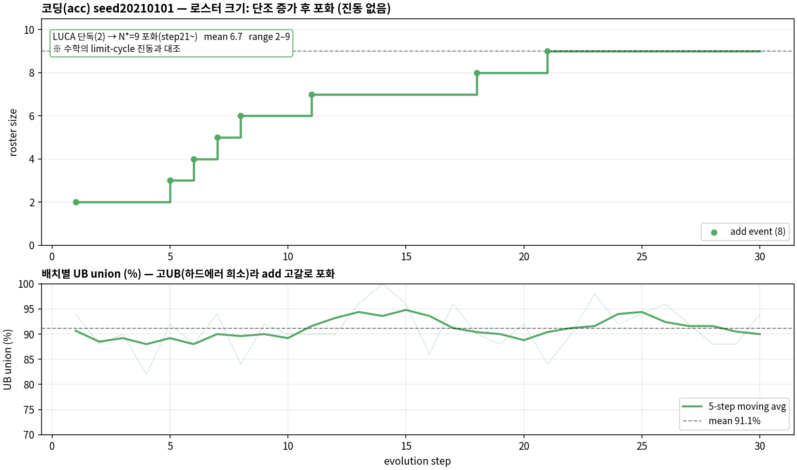

# Handover — Coding(acc) scout-evolution (seed20210101)

> numina(math) 핸드오버([HANDOVER_numina_scout.md](HANDOVER_numina_scout.md))의 코딩 도메인 판. 표준 레시피 = **seed18 방식**(windowed-deletion gatefix + topic scout, 문제 설명만). 수학과 달리 **UB가 높고 상보성이 살아있는** 첫 도메인.

## 0. 용어 (numina와 동일 개념)

- **hard error**: 그 batch에서 로스터 전원이 못 푼 문제. scout에 전달됨(여기선 **문제 설명만**, 틀린 풀이과정 X = seed18 표준).
- **UB union**: 전문가 각자 solo로 돌려 union(≥1명 풀면 정답) = oracle 상한. 라우팅 무관. `--pipeline binning` + [score_binning.py](../scripts/score_binning.py).
- **routed pass@1**: 매니저가 문제당 전문가 1명 선택(route-to-one) 후 채점.
- **exclusive_solves**: 각 전문가가 단독으로만 맞힌 문제(그 전문가만의 niche). roster_final.json에 저장(에이전트별 최근 ~10개 × 200자).

## 1. 프로젝트 한 줄

고정 백본(gemma-4-26B-A4B) 위에서 **프롬프트-레벨 전문가 로스터를 진화**. 코딩 도메인 = **acc**(= Minji의 QuantCat/Algorithm-Dataset = 사실상 **TACO** 데이터셋; [taco/taco_readme.md](../taco/taco_readme.md)). 우리 영역 = 데이터셋 정합화 + 진화 + 로스터 + UB. 다운스트림 weight-MoE 학습은 협업자 몫.

## 2. 데이터셋 정합화 (진화 전 필수 선행 — 채점기가 깨져 있었음)

### 문제
Minji 덤프의 ref 솔루션이 **자기 테스트를 self-exec로 통과 못 함**(function_call 0% self-consistency, stdin ~55%). 채점기가 깨져 있어 진화가 무의미했음. 출처 미기재였으나 4×교차확인으로 **TACO 확정**(fn_name 있으면 call_based / None이면 standard_input).

### 3가지 실행 모드 ([src/evaluation/acc_exec/](../src/evaluation/acc_exec/), `ExecutionInterface`가 eval_mode로 러너 선택)
- **stdin_stdout** ([stdin_stdout_runner.py](../src/evaluation/acc_exec/stdin_stdout_runner.py)): 표준입출력 비교.
- **function_call** ([function_call_runner.py](../src/evaluation/acc_exec/function_call_runner.py)): 시그니처 호출. **0→82%로 수정** — ①문자열 스칼라 재귀 `json.loads` ②[return] 1-원소 언랩 ③`class Solution` fallback ④typing/collections import 헤더 주입.
- **gfg_function** ([gfg_runner.py](../src/evaluation/acc_exec/gfg_runner.py)): GeeksforGeeks식 pseudo-stdin(`param=value`)을 시그니처 순서로 파싱→호출→포맷→토큰비교. **신규 러너**.

### 산출물 (`export/acc_selfconsistent/acc_train.jsonl`, 16,136 레코드)
- **self-consistency 필터**: ref를 자기 테스트로 실제 실행해 통과한 것만 유지(census 65.7%).
- **gfg 역설계 복구**: pseudo-stdin을 시그니처에 역매핑해 +1507건 복구([scripts/gfg_recover.py](../scripts/gfg_recover.py)).
- 빌더 [scripts/build_acc_selfconsistent.py](../scripts/build_acc_selfconsistent.py) + starter_code 후처리 [scripts/add_starter_code.py](../scripts/add_starter_code.py).
- `score_one`에 acc 브랜치 배선([scorer.py](../src/evaluation/scorer.py) `score_acc_item`, `scoring_kind="acc"`).

## 3. 진화 (seed20210101)

- **레시피 = seed18 표준**: windowed-deletion gatefix(`deletion_window=16, floor=0, delete_cooldown=8`) + topic scout(**문제 설명만**; failure-mode/exclusive/풀이과정 없음). init = **LUCA 단독**. batch 50, `enable_thinking=false`.
- config [configs/acc_train_seed20210101.yaml](../configs/acc_train_seed20210101.yaml). train_size 2500(smoke, 풀런시 16136).
- **잡 202238** — step 31/50에서 사용자 지시로 중단하고 그 상태(roster N=9)로 평가. resume 자료(`evolution_log.jsonl`)는 nested `results/acc/seed20210101/acc/seed20210101/`에 있음.

### 로스터 동역학 — 수학과 다름
**2→9로 단조 증가 후 step21부터 9에서 포화(진동 없음).** 수학의 limit-cycle 진동과 대조 — gatefix+고UB 조합에서 delete 거의 안 걸리고, add도 하드에러 고갈(고UB)로 noop이 되는 안정 상태. figure: [docs/fig_roster_acc_seed101.png](fig_roster_acc_seed101.png) (생성: [scripts/make_acc_roster_fig.py](../scripts/make_acc_roster_fig.py)).

### 최종 로스터 (N=9, step30) — LUCA 지배 + 8 전문가(critic 5축과 자동 정렬)
| # | 이름 | 전문분야 | 단일 pass@1 |
|---|------|----------|:---:|
| 1 | LUCA | General programming assistance and baseline critique | 82.2 |
| 2 | Polyglot Combinatorist | Multilingual comprehension, DP, combinatorial enumeration | 85.0 |
| 3 | Simulation Architect | Graph traversal, state-machine, discrete event simulation | 82.4 |
| 4 | Spatial Data Specialist | 2D/3D Segment/Fenwick/KD-Trees, computational geometry | 83.0 |
| 5 | Linguistic Pattern Analyst | Cross-lingual semantic extraction, NL→formal logic | 82.8 |
| 6 | Data Structure Strategist | DSU, Fenwick/Segment Trees, lazy prop., dynamic connectivity | 83.2 |
| 7 | Number Theory Specialist | Modular exp., bitwise, primality, CRT, Euler totient | **86.2** |
| 8 | Implementation Precision Engineer | Discrete event sim., grid state machines, edge-case handling | 84.4 |
| 9 | Greedy Heuristic Optimizer | Greedy design, exchange args, matroid, amortized analysis | 83.2 |

> ⚠️ 중복 신호: Polyglot·Linguistic 둘 다 multilingual, Spatial·DataStructure 둘 다 range 자료구조 → §5 라우터 병목의 (a) 원인.

## 4. 결과 — ⭐ 수학보다 UB 높고 상보성 살아있음

### 4-1. 메인 (홀드아웃 500, seed20210101)
| 지표 | LUCA 단독 | routed top-1 | routed top-2 | UB union(9인) |
|---|---|---|---|---|
| pass@1 (%) | 83.4 | 84.4 | **87.8** | **92.8** |
| n / 500 | 417 | 422 | 439 | 464 |
| 잡 | 202289 | 202333 | 202727 | 202289 |

- **top-2 = union(둘 중 통과=정답)**, 첫 픽 84.0 → 2번째 픽이 **19문제 회수(+3.8pp)**. 무작위 top-2 추정(88.0)과 거의 일치 → 라우터의 2픽 ≈ 무작위 2픽.

### 4-2. 분해 품질
| 지표 | 값 |
|---|---|
| per-expert pass@1 (binning) | 82.2(luca) – **86.2**(Number Theory) |
| 상보성 (UB − best expert) | **+6.6pp** |
| 순수 라우팅 손실 (UB − routed top-1) | **+8.4pp (42문제)** |
| 커버리지 분포 (n_solved→#문제) | `{0:36, 1:10, 2:10, 3:11, 4:13, 5:7, 6:10, 7:14, 8:47, 9:342}` |
| 아무도 못 푼 것 (진짜 하드에러) | 36 (7.2%) |
| 전원(9) 해결 | 342 (68.4%) |

- **수학 대비**: UB 92.8 vs 수학 ~77–82. 코딩은 역할부여(분화)가 실제 헤드룸을 만듦 → "역할이 정오답에 영향 주는 도메인" 가설 확증.

### 4-3. 풀런 (train 16136) — 미실행
| 지표 | routed top-1 | routed top-2 | UB union |
|---|---|---|---|
| pass@1 | — | — | — |
| 잡 | — | — | — |

## 5. ⚠️ 병목 = 라우터 (route-to-one이 헤드룸 못 거둠)

- **routed 84.4 vs UB 92.8 → 42문제(8.4pp)가 순수 라우팅 손실**(누군가는 푸는데 라우터가 틀린 전문가 선택).
- **결정적 발견**: 라우터 top-1(84.4%)이 **무작위 top-1(83.6%)과 사실상 동급.** 쉬운 342문제(전원해결)를 공짜로 먹을 뿐, 변별이 필요한 문제선 신호를 거의 못 뽑음. → **라우터 프롬프트/정보/few-shot 변형(strengths→description, thinking on, retrieval few-shot 등)은 전부 84%대로 무효**(그 실험분기는 폐기).
- 원인 2층: (a) **로스터 분화 중복**(Polyglot·Linguistic 둘 다 multilingual, Spatial·DataStructure 둘 다 range 자료구조 → route-to-one이 union 못 담음), (b) route-to-one 자체가 천장.

### top-k 라우팅 (커버리지 기반 추정 vs 실측)
| 방식 | 추정(무작위) | 실측(라우터) |
|---|---|---|
| top-1 | 83.6 | 84.4 |
| **top-2** | **88.0** | **87.8** (202727) |
| top-3 | 89.7 | — |
| UB (oracle) | 92.8 | 92.8 |

- **top-2 실측 87.8 ≈ 무작위 추정 88.0** → 라우터가 top-1에서도 top-2에서도 무작위와 동급. 헤드룸(→92.8)은 "2번 기회"로 일부만(+3.4pp) 회수, 나머지는 라우터 변별력 부족이라 못 감.

- **핵심**: 라우터 top-1(84.4) ≈ 무작위 top-1(83.6) → 라우터가 변별을 거의 못 함.
- **top-2 = 값 있음**: 무작위여도 88%(+3.6pp), **코딩은 실행으로 검증 가능**하니 "2명 돌려 테스트 통과하는 쪽 채택"이 정당(union 값 그대로 실현). 88→92.8은 라우터가 그 2명을 무작위보다 잘 골라야(=다시 변별 문제).
- 구현: `router_top_k` 토글([routing_inference.py](../src/pipelines/routing_inference.py) run_batch, k=1=byte-identical) — 라우터가 `selected_expert_ids` k개 반환→각 생성→[score_outputs_topk.py](../scripts/score_outputs_topk.py)가 union 채점. **잡 202727 진행 중**(config [acc_eval_a4b_top2.yaml](../configs/acc_eval_a4b_top2.yaml)).

## 6. 코드 지도 (코딩 전용 변경점)

- 채점 [src/evaluation/scorer.py](../src/evaluation/scorer.py)(`score_acc_item`), [src/evaluation/acc_exec/](../src/evaluation/acc_exec/)(3 러너 + `execution_interface.py`), [src/data/loader.py](../src/data/loader.py)(`scoring_kind` acc 브랜치, local jsonl 로딩).
- 데이터셋 빌더: [scripts/build_acc_selfconsistent.py](../scripts/build_acc_selfconsistent.py), [scripts/gfg_recover.py](../scripts/gfg_recover.py), [scripts/add_starter_code.py](../scripts/add_starter_code.py).
- 라우팅 [src/pipelines/routing_inference.py](../src/pipelines/routing_inference.py): `router_top_k`(top-k union), 그 외 라우터 토글(desc/thinking/few_shot/retrieval)은 **폐기 실험분기라 기본 OFF**.
- eval: [run_acc_eval.sh](../scripts/sbatch/run_acc_eval.sh)(LUCA baseline + binning UB), [run_acc_eval_routed.sh](../scripts/sbatch/run_acc_eval_routed.sh)(routed), [run_acc_eval_top2.sh](../scripts/sbatch/run_acc_eval_top2.sh)(top-k union). config [acc_eval_a4b.yaml](../configs/acc_eval_a4b.yaml)(tp=1).
- **acc는 `acc_test.jsonl` 없음** → eval은 `--split train` + `test_ids.json`(홀드아웃 13636) 필터로 돌림. EVAL_SIZE 500.

## 7. 잡

| 잡 | 내용 | 상태 / 측정 |
|---|---|---|
| 202238 | seed20210101 진화(smoke, batch50) | CANCELLED step31 → N=9 로스터로 평가 |
| 202289 | LUCA baseline + 최종로스터 UB | COMPLETE — baseline 83.4 / **UB 92.8** |
| 202333 | 최종로스터 routed | COMPLETE — **84.4** |
| 202727 | **top-2 routing** eval | COMPLETE — **union 87.8** (top-1 84.0, +19 회수) |

## 8. 제약/주의

- **커밋 메시지: 무조건 한 줄. Co-Authored-By / Claude 이름 절대 금지.** 커밋 착수 전 `git fetch`로 로컬/원격 divergence 확인, push/force는 명시 지시 있을 때만.
- **⚠️ HF 캐시는 /data5**(홈 쿼터 작음, 모델 49–52G). [common_bigmath.sh](../scripts/sbatch/common_bigmath.sh) `setup_job_env()`가 HF_HOME/TRANSFORMERS_CACHE=/data5 강제.
- **⚠️ 노드 오프라인 함정**: 랩서버 확장(n05 추가) 재부팅 후 일부 노드 인터넷 불가 → HF가 기본 온라인 revision 체크에서 DNS 실패로 죽음(모델은 로컬인데도). 대응: 오프라인 노드는 `HF_HUB_OFFLINE=1`(common_bigmath에 opt-in), 또는 `EXCLUDE=n05`로 제외. **현재 n05는 전력문제로 사용 금지 → 제출 시 `--exclude=n05`.**

## 9. 다음 액션

1. ~~top-2 확인~~ **완료**: union 87.8(무작위 88.0과 동급). top-k는 "2번 기회"로 +3.4pp만 주고 라우터 변별력 부족이라 UB(92.8) 못 감. → 헤드룸 회수는 top-k보다 **라우터 변별력** 또는 **로스터 중복 제거**가 핵심.
2. **풀런**(train_size 16136) — smoke는 2500이었음. batch는 고UB(하드에러 ~10%)라 20–25/스텝 목표엔 ~200 필요(현 50은 ~5).
3. (선택) 로스터 분화 중복 완화 — scout가 Polyglot/Linguistic 같은 포괄·중복 페르소나 안 만들게.
