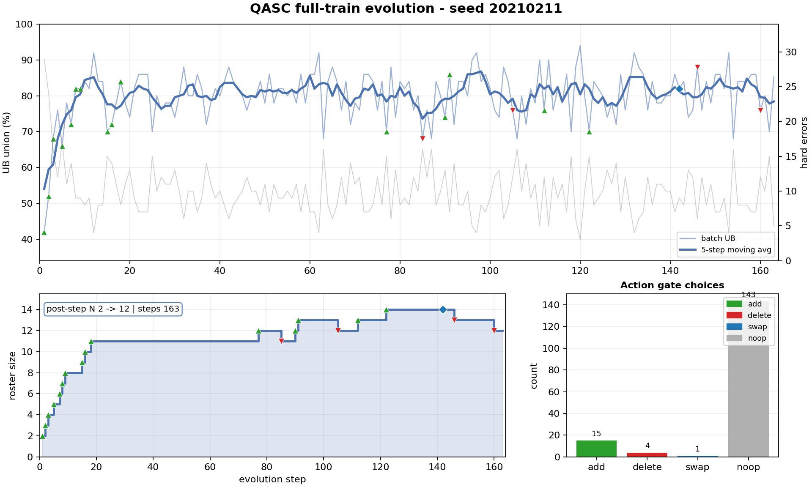
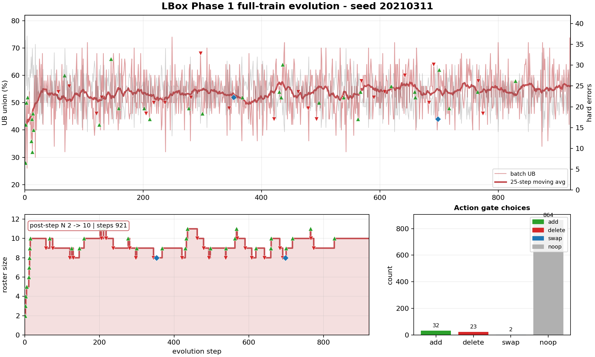

# Handover - QASC + Legal(LBox) full-train run (seed20210211 / seed20210311)

> acc(코딩) 핸드오버([HANDOVER_acc_coding.md](HANDOVER_acc_coding.md))와 같은 양식의 신규 도메인 핸드오버. 현재 결론은 **full train set evolution 완료**, **QASC train 전체 agent-solve labeling 완료**, **LBox train 전체 agent-solve labeling 진행 중**이다.

## 0. 용어

- **hard error**: 그 batch에서 현재 로스터 전원이 못 푼 문제. scout에 전달됨(문제 설명만, 정답/풀이/참조문헌 없음).
- **UB union**: 전문가 각자 solo로 돌려 union(>=1명 풀면 정답) = oracle 상한. 라우팅 무관.
- **binning / labeling pass**: 최종 로스터의 모든 agent가 train 문제 전체를 풀고, 문제별 `solved_by` / `failed_by`와 agent별 `solved_problem_ids`를 만드는 MoE 학습용 라벨 생성.
- **Phase 1 Legal**: LBox 중 `casename` + `statute`만 사용. `ljp_*` 양형 bucket과 summarization/precedent corpus는 제외.

## 1. 프로젝트 한 줄

고정 백본(`google/gemma-4-26B-A4B-it`) 위에서 프롬프트-레벨 전문가 로스터를 진화한다. 기존 math/coding 2분기를 **QASC(과학 8지선다) + Legal(LBox_open 한국 법률 EM)**까지 확장했고, 이번 라운드는 downstream MoE 학습에 줄 **train 전체 expert-solve membership**을 만들기 위해 valid가 아니라 **full train set 기준으로 evolution부터 다시 수행**했다.

## 2. 데이터셋 정합화

### QASC

- 소스: `allenai/qasc`.
- 사용 split: train 8,134 / validation 926. test는 라벨 없음이라 제외.
- 산출물:
  - `export/qasc/qasc_train.jsonl`: **8,134**
  - `export/qasc/qasc_validation.jsonl`: **926**
- 빌더: [scripts/build_qasc.py](../scripts/build_qasc.py).
- 레코드 형태: `instruction`은 `formatted_question` 그대로, `ground_truth`는 A-H 한 글자, `scoring_kind="qasc"`.
- reference 정책: fact1/fact2는 넣지 않음. 1차 목표는 "문제+보기만으로 프롬프트 역할분화가 먹히나" 측정.

### Legal / LBox Phase 1

- 소스: `lbox/lbox_open`.
- 사용 config: `casename_classification`, `casename_classification_plus`, `statute_classification`, `statute_classification_plus`.
- 제외: summarization 계열, `precedent_corpus`, `ljp_civil`, `ljp_criminal`.
- 산출물:
  - `export/lbox/lbox_train.jsonl`: **46,019**
  - `export/lbox/lbox_valid.jsonl`: **7,651**
  - valid 분포: `casename=4,999`, `statute=2,652`
- 빌더: [scripts/build_lbox.py](../scripts/build_lbox.py).
- 레코드 형태: `task_type`으로 casename/statute를 구분하고, task별 지시문을 `instruction` 앞에 붙임.

### 채점기

- QASC: [src/evaluation/scorer.py](../src/evaluation/scorer.py) `score_qasc_item` - 출력에서 A-H letter 추출 후 exact match.
- LBox: [src/evaluation/scorer.py](../src/evaluation/scorer.py) `score_lbox_item`
  - `casename`: 정규화 string EM.
  - `statute`: 법조문 set EM(순서 무관, 부분집합은 오답).
- loader 배선: [src/data/loader.py](../src/data/loader.py)에서 `scoring_kind`를 `qasc` / `lbox`로 디스패치.
- 검증: `pytest tests/test_scorer.py tests/test_prompts.py` 통과.

## 3. Full-Train Evolution

- 레시피: windowed-deletion gatefix(`deletion_window=16`, `floor=0`, `delete_cooldown=8`) + topic scout(문제 설명만) + LUCA 시작 + `enable_thinking=false`.
- Action gate는 phase1 add / phase2 delete를 독립 계산하고 4-action으로 결합한다: `noop`, `add`, `delete`, `swap`.
- 이번 full run은 train 전체를 순회한다. valid/test holdout 필터는 사용하지 않는다.

| 도메인 | seed | train n | batch | steps | action counts | roster | UB first -> last | UB max | UB last10 mean | hard first -> last | hard min |
|---|---:|---:|---:|---:|---|---:|---:|---:|---:|---:|---:|
| QASC | 20210211 | 8,134 | 50 | 163 | add 15 / delete 4 / swap 1 / noop 143 | 1 -> **12** | 42.0 -> **85.3** | **94.0** | **80.3** | 29 -> **5** | **3** |
| LBox Phase 1 | 20210311 | 46,019 | 50 | 921 | add 32 / delete 23 / swap 2 / noop 864 | 1 -> **10** | 28.0 -> **73.7** | **74.0** | **56.8** | 36 -> **5** | **5** |

- QASC는 full train 기준에서 smoke보다 로스터가 더 커져 N=12로 수렴했다. delete/swap도 실제 발동했고, 마지막 batch UB는 85.3%.
- LBox는 921 step으로 train 전체를 돌았다. N=10으로 끝났고, 중간 churn(add/delete/swap)이 QASC보다 훨씬 많다.
- LBox train prompt 중 16k context를 넘는 항목이 있어 full run config에 `max_prompt_chars: 12000` truncation을 넣었다. 이전 overlong prompt 실패는 이 경로에서 회피했다.

QASC full-run figure: [docs/fig_fullrun_qasc_seed20210211.png](fig_fullrun_qasc_seed20210211.png)



LBox full-run figure: [docs/fig_fullrun_lbox_seed20210311.png](fig_fullrun_lbox_seed20210311.png)



## 4. 최종 로스터

### QASC full-train roster (N=12)

| # | 이름 | 전문분야 / strength | 단일 pass@1 |
|---:|---|---|:---:|
| 1 | LUCA | General baseline | 64.3 |
| 2 | Biological Systems Specialist | Life science, ecology, physiology, organism-environment interaction | 33.2 |
| 3 | Environmental Science Generalist | Ecology, environmental health, planetary systems, habitat effects | 70.8 |
| 4 | Human Biology Expert | Human physiology, pathology, anatomy, human behavior/development | 77.8 |
| 5 | Earth Science Generalist | Atmosphere, hydrosphere, planetary processes, state changes in nature | 81.7 |
| 6 | Applied Mathematical Modeler | Quantitative natural phenomena: volume, rates, dimensions, measurements | 82.1 |
| 7 | Cognitive Neuroscientist | Sensory perception, neural response, stimuli processing | 81.9 |
| 8 | Microbiology Specialist | Bacteria/virus behavior, cellular structure, reproduction/classification | 80.8 |
| 9 | General Ecology Specialist | Food chains, life cycles, organism-environment relationships | 78.8 |
| 10 | Geological Process Specialist | Erosion, sedimentation, geological material transformation | 80.2 |
| 11 | Zoological Biologist | Animal physiology, locomotion, instinct, life cycles | 77.8 |
| 12 | Evolutionary Biologist | Natural selection, adaptation, survival pressure, extinction | **83.9** |

QASC는 bio/ecology/earth science/human biology/math model/neuro/microbiology/geology/zoology/evolution 쪽으로 분화했다. validation 전체 기준 best expert는 Evolutionary Biologist(83.9)이고, LUCA 단독 eval보다 +24.0pp 높다.

### LBox full-train roster (N=10)

| # | 이름 | 전문분야 / strength | 단일 pass@1 |
|---:|---|---|:---:|
| 1 | Judicial Precedent Classifier | 복잡한 사실관계 -> 공식 사건명/죄명 분류 | 43.2 |
| 2 | Legal Case Typology Architect | 판례형 사건유형/공식 법률명 nomenclature 변환 | **45.1** |
| 3 | Statutory Element Matcher | 사실요소와 조문 구성요건의 granular 매칭 | 35.6 |
| 4 | Legal Nomenclature Purist | 대법원식 표준 사건명/죄명 canonical label | 43.6 |
| 5 | Legal Fact Synthesis Engine | 다층 사실관계에서 복수 죄명/사건명을 통합 추출 | 39.5 |
| 6 | Legal Provision Auditor | 누락 없는 적용 조문 exhaustive identification | 32.5 |
| 7 | Civil Dispute Taxonomy Expert | 계약해제/손해배상/물권 등 민사 사건유형 구분 | 39.3 |
| 8 | Judicial Labeling Precisionist | 증거/절차 맥락 제거 후 정확한 1-line 공식 label 추출 | 35.4 |
| 9 | Legal Recidivism Analyst | 전과/상습/누범에 따른 가중 조문 탐지 | 34.9 |
| 10 | Criminal Charge Aggregator | 여러 형사행위를 formal charge list로 집계 | 34.2 |

LBox 최종 roster는 법률명/사건유형/조문요건/죄명 aggregation 중심으로 분화했다. valid 전체 기준 best expert는 Legal Case Typology Architect(45.1)다.

## 5. 결과

### 5-1. Full-run roster heldout eval

full-train으로 새로 진화한 roster 기준 valid eval을 새로 제출했다. 아래 표는 smoke roster archive가 아니라 **seed20210211 / seed20210311 final roster** 기준으로 채울 메인 표다.

#### QASC validation 926, full-train roster

| 지표 | LUCA 단독 | routed top-1 | routed top-2 | UB union |
|---|---:|---:|---:|---:|
| pass@1 (%) | 59.9 | 75.3 | **85.4** | **94.8** |
| n / 926 | 555 | 697 | 791 | 878 |
| 잡 | 204222 | 204221 | 204221 | 204222 |

- routed top-2 자체의 first pick은 74.0%(685/926), 2번째 픽이 106문제 회수(+11.4pp).

#### LBox Phase 1 valid 7,651, full-train roster

| 지표 | LUCA 단독 | routed top-1 | routed top-2 | UB union |
|---|---:|---:|---:|---:|
| pass@1 (%) | 38.5 | 39.1 | **47.7** | **56.9** |
| n / 7,651 | 2,943 | 2,988 | 3,650 | 4,354 |
| 잡 | 204224 | 204223 | 204223 | 204224 |

- routed top-2 자체의 first pick은 39.1%(2,994/7,651), 2번째 픽이 656문제 회수(+8.6pp).

### 5-2. 분해 품질

| 지표 | QASC validation 926 | LBox Phase 1 valid 7,651 |
|---|---:|---:|
| best expert pass@1 | **83.9** (Evolutionary Biologist, 777/926) | **45.1** (Legal Case Typology Architect, 3,447/7,651) |
| 상보성 (UB - best expert) | **+10.9pp** | **+11.9pp** |
| 라우팅 손실 (UB - routed top-1) | **+19.5pp** (181문제) | **+17.9pp** (1,366문제) |
| top-2 후 남은 손실 (UB - routed top-2) | **+9.4pp** (87문제) | **+9.2pp** (704문제) |
| top-2 추가 회수 | +106문제 (+11.4pp, 자체 first-pick 대비) | +656문제 (+8.6pp, 자체 first-pick 대비) |
| 아무도 못 푼 것 | 48 (5.2%) | 3,297 (43.1%) |
| 전원 해결 | 183/926 (19.8%, 12인) | 1,145/7,651 (15.0%, 10인) |

### 5-3. Train 전체 Labeling / Binning

목표는 downstream MoE 학습용으로 **각 train 문제를 어떤 agent가 맞혔는지** 기록하는 것이다. 파일 흐름은 다음과 같다.

1. `run_inference.py --pipeline binning`
   - 최종 roster의 모든 agent가 train 전체를 풂.
   - raw answer 저장: `binning_train_full.jsonl`.
2. `score_binning.py`
   - 각 agent 출력 채점.
   - 문제 중심 라벨 저장: `binning_train_full.binned.jsonl`.
3. `export_binning_solve_index.py`
   - agent 중심 solve index 저장: `binning_train_full.binned.agent_solves.json`.

#### QASC train labeling 완료

| 지표 | 값 |
|---|---:|
| train n | 8,134 |
| raw outputs | 8,134 |
| binned labels | 8,134 |
| experts | 12 |
| UB union | **81.26%** |
| solved by >=1 expert | **6,610** |
| solved by 0 experts | 1,524 |
| solved by all 12 experts | 1,064 |

QASC 산출물:

- `results/qasc/seed20210211/binning_train_full.jsonl`
- `results/qasc/seed20210211/binning_train_full.binned.jsonl`
- `results/qasc/seed20210211/binning_train_full.binned.summary.json`
- `results/qasc/seed20210211/binning_train_full.binned.agent_solves.json`

agent-solve index 스키마:

```json
{
  "input": "results/qasc/seed20210211/binning_train_full.binned.jsonl",
  "dataset": "qasc",
  "split": "train",
  "total": 8134,
  "experts": ["luca", "c_54731", "..."],
  "per_agent": {
    "luca": {
      "solved": [{"id": "problem_id"}],
      "failed": [{"id": "problem_id"}],
      "n_solved": 3770,
      "n_failed": 4364,
      "pass_at_1": 46.34865994590607
    }
  },
  "problems": [
    {
      "id": "problem_id",
      "dataset": "qasc",
      "task_type": null,
      "solved_by": ["luca", "c_33055"],
      "n_solved": 2
    }
  ]
}
```

#### LBox train labeling 완료

| 지표 | 값 |
|---|---:|
| train n | 46,019 |
| raw outputs | 46,019 |
| binned labels | 46,019 |
| experts | 10 |
| UB union | **56.02%** |
| solved by >=1 expert | **25,781** |
| solved by 0 experts | 20,238 |
| solved by all 10 experts | 6,863 |
| Slurm job | 203991 |

LBox 산출물:

- `results/lbox/seed20210311/binning_train_full.jsonl`
- `results/lbox/seed20210311/binning_train_full.binned.jsonl`
- `results/lbox/seed20210311/binning_train_full.binned.summary.json`
- `results/lbox/seed20210311/binning_train_full.binned.agent_solves.json`

LBox `agent_solves.json`도 같은 스키마를 사용한다. 차이는 각 entry에 `task_type`이 붙는다는 점이다.

```json
{
  "input": "results/lbox/seed20210311/binning_train_full.binned.jsonl",
  "dataset": "lbox",
  "split": "train",
  "total": 46019,
  "experts": ["c_29934", "c_28126", "..."],
  "per_agent": {
    "c_29934": {
      "solved": [{"id": "statute_statute_classification_plus_train_12871", "task_type": "statute"}],
      "failed": [{"id": "casename_casename_classification_train_0", "task_type": "casename"}],
      "n_solved": 19827,
      "n_failed": 26192,
      "pass_at_1": 43.08437819161651
    }
  },
  "problems": [
    {
      "id": "problem_id",
      "dataset": "lbox",
      "task_type": "casename",
      "solved_by": ["c_28126", "c_24222"],
      "n_solved": 2
    }
  ]
}
```

## 6. 기존 heldout eval 결과 (archive)

아래 값은 smoke roster(seed20210201 / seed20210301)로 측정한 heldout eval이다. 현재 메인 결론은 full-train roster 기준으로 바뀌었으므로 archive로만 둔다.

### QASC validation 926, smoke roster

| 지표 | LUCA 단독 | routed top-1 | routed top-2 | UB union |
|---|---:|---:|---:|---:|
| pass@1 (%) | 60.0 | 69.3 | **79.0** | **95.8** |
| n / 926 | 556 | 642 | 732 | 887 |
| 잡 | 202893 | 202897 | 202897 | 202893 |

### LBox Phase 1 valid 500, smoke roster

| 지표 | LUCA 단독 | routed top-1 | routed top-2 | UB union |
|---|---:|---:|---:|---:|
| pass@1 (%) | 34.6 | 38.8 | **43.6** | **52.6** |
| n / 500 | 173 | 194 | 218 | 263 |
| 잡 | 202895 | 202898 | 202898 | 202895 |

## 7. 코드 지도

- 도메인 분기: [src/utils/domains.py](../src/utils/domains.py) `task_family`, `is_text_generation_task`.
- 출력 후처리: [src/utils/helpers.py](../src/utils/helpers.py) `finalize_generation_output` - QASC/LBox는 코드블록 추출 없이 raw answer 유지.
- prompts:
  - [src/prompts/baseline_prompts.py](../src/prompts/baseline_prompts.py)
  - [src/prompts/coding.py](../src/prompts/coding.py) `build_expert_prompt` domain branch
  - [src/prompts/meta.py](../src/prompts/meta.py) QASC/LBox scout/router prompt
- scorer/loader:
  - [src/evaluation/scorer.py](../src/evaluation/scorer.py) `score_qasc_item`, `score_lbox_item`
  - [src/data/loader.py](../src/data/loader.py) local JSONL + `scoring_kind`
- full-run configs:
  - [configs/qasc_train_full_seed20210211.yaml](../configs/qasc_train_full_seed20210211.yaml)
  - [configs/lbox_train_full_seed20210311.yaml](../configs/lbox_train_full_seed20210311.yaml)
  - [configs/lbox_eval_a4b_train_binning.yaml](../configs/lbox_eval_a4b_train_binning.yaml)
- figures:
  - [scripts/make_qasc_lbox_fullrun_figs.py](../scripts/make_qasc_lbox_fullrun_figs.py)
  - [docs/fig_fullrun_qasc_seed20210211.png](fig_fullrun_qasc_seed20210211.png)
  - [docs/fig_fullrun_lbox_seed20210311.png](fig_fullrun_lbox_seed20210311.png)
- full-train labeling:
  - [scripts/sbatch/run_domain_full_binning.sh](../scripts/sbatch/run_domain_full_binning.sh)
  - [scripts/export_binning_solve_index.py](../scripts/export_binning_solve_index.py)
  - [scripts/run_inference.py](../scripts/run_inference.py) `--ignore_test_ids`, `max_prompt_chars`
- evolution:
  - [scripts/run_evolution.py](../scripts/run_evolution.py) `max_prompt_chars`
  - [src/action_selector.py](../src/action_selector.py) 2-phase action gate
  - [src/orchestrator.py](../src/orchestrator.py) action 적용 및 scout/probe

## 8. 잡

| 잡 | 내용 | 상태 / 측정 |
|---|---|---|
| 203988 | QASC full-train evolution | COMPLETE - 163 steps, final N=12 |
| 203989 | QASC full-train binning/labeling | COMPLETE - 8,134/8,134, agent solve index 생성 |
| 203990 | LBox full-train evolution | COMPLETE - 921 steps, final N=10 |
| 203991 | LBox full-train binning/labeling | COMPLETE - 46,019/46,019, agent solve index 생성 |
| 204222 | QASC full-valid eval, full-run roster | COMPLETE - validation 926, LUCA 59.9 / UB 94.8 |
| 204221 | QASC full-valid routed eval, full-run roster | COMPLETE - validation 926, top-1 75.3 / top-2 85.4 |
| 204224 | LBox full-valid eval, full-run roster | COMPLETE - valid 7,651, LUCA 38.5 / UB 56.9 |
| 204223 | LBox full-valid routed eval, full-run roster | COMPLETE - valid 7,651, top-1 39.1 / top-2 47.7 |
| 202893 | QASC smoke roster LUCA baseline + UB | ARCHIVE - LUCA 60.0 / UB 95.8 |
| 202897 | QASC smoke roster routed top-1 + top-2 | ARCHIVE - top-1 69.3 / top-2 79.0 |
| 202895 | LBox smoke roster LUCA baseline + UB | ARCHIVE - valid 500, LUCA 34.6 / UB 52.6 |
| 202898 | LBox smoke roster routed top-1 + top-2 | ARCHIVE - valid 500, top-1 38.8 / top-2 43.6 |

## 9. 제약/주의

- **커밋 메시지: 무조건 한 줄. Co-Authored-By / Claude 이름 금지.** 커밋 전 `git fetch`로 divergence 확인, push/force는 명시 지시 있을 때만.
- **HF 캐시는 /data5**. [common_bigmath.sh](../scripts/sbatch/common_bigmath.sh) `setup_job_env()`가 `HF_HOME`/`TRANSFORMERS_CACHE`를 `/data5`로 강제.
- **n05 노드 전력문제로 사용 금지** -> 제출 시 `--exclude=n05`.
- QASC split 이름은 `validation`, LBox split 이름은 `valid`.
- train 전체 labeling에서는 `test_ids.json` 필터가 걸리면 안 된다. [scripts/sbatch/run_domain_full_binning.sh](../scripts/sbatch/run_domain_full_binning.sh)는 기본 `IGNORE_TEST_IDS=1`로 `--ignore_test_ids`를 넘긴다.
- LBox는 긴 facts 때문에 context overflow가 날 수 있다. 현재 full-train evolution/binning config는 `max_prompt_chars: 12000`으로 앞 75% + 뒤 25%를 보존한다.
- 전체 `pytest`는 기존 테스트 4개가 별도로 실패한다. 이번 도메인 변경 대상 테스트(`tests/test_scorer.py`, `tests/test_prompts.py`)는 통과.

## 10. 다음 액션

1. **MoE 학습 입력 연결**: QASC/LBox 모두 `binning_train_full.binned.agent_solves.json` 준비 완료. `per_agent[*].solved` 또는 `problems[*].solved_by` 중 downstream trainer가 쓰기 쉬운 축으로 ingestion한다.
2. **라우터 병목 분석**: full-run roster에서도 QASC UB 94.8 vs top-2 85.4, LBox UB 56.9 vs top-2 47.7로 gap이 남는다.
3. **LBox 정보 부족 검토**: full valid에서 아무도 못 푼 문제가 3,297/7,651(43.1%)라 retrieval/statute 후보 제공 여부를 검토한다.
